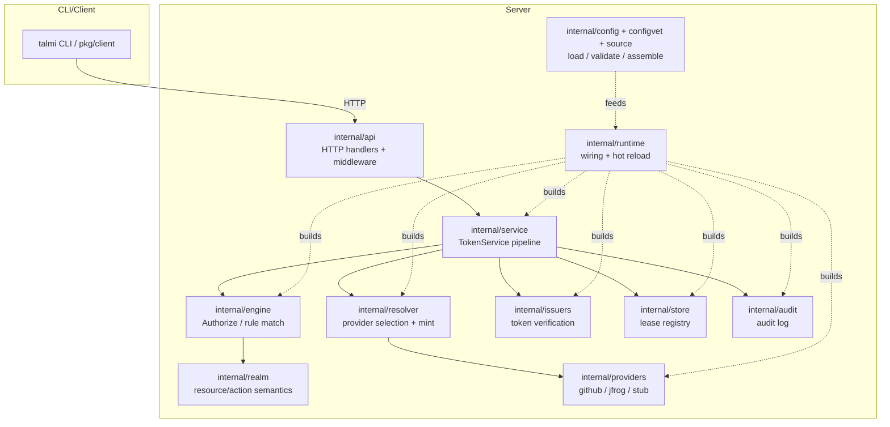
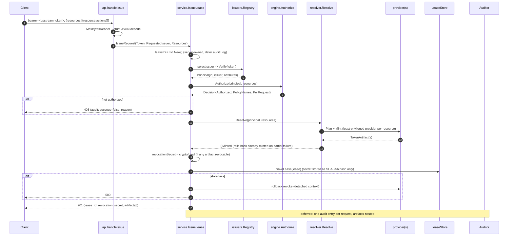
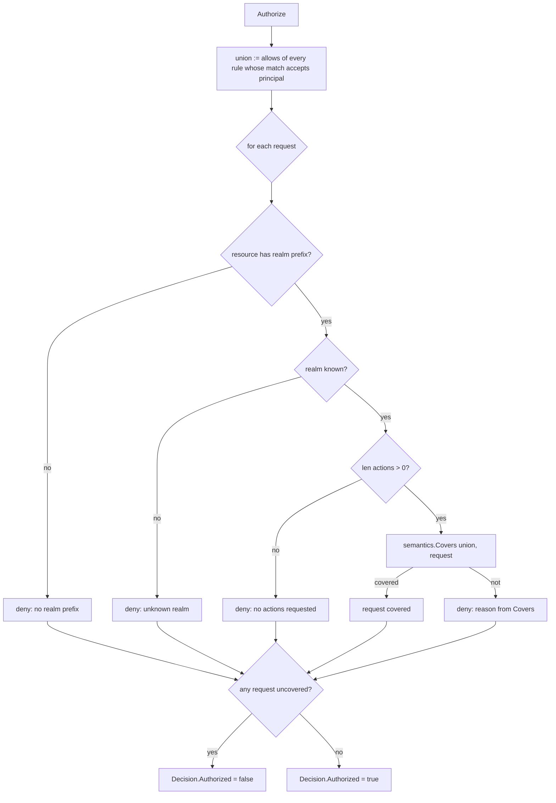
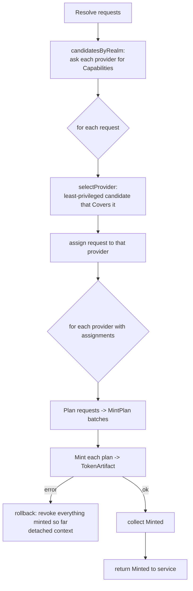
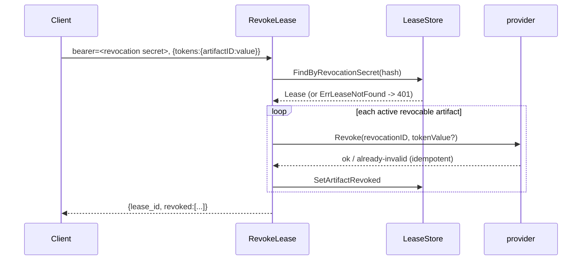
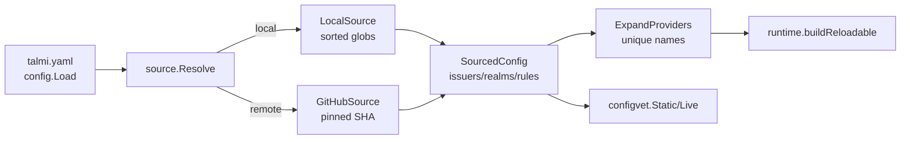

# Contributing & Developer Guide

This document explains how Talmi works internally: the architecture, the request
pipelines, the authorization model, and where the important invariants live. It
is aimed at contributors who need to change behavior safely.

If you only want to *configure* Talmi, start with the top-level [`README.md`](README.md)
and the per-directory guides under [`example/`](example/).

---

## High-level architecture

### Package map

Here are the most important packages and their use:

| Package              | Responsibility                                                                                                                                       |
|----------------------|------------------------------------------------------------------------------------------------------------------------------------------------------|
| `internal/core`      | Domain types shared by everyone: `Principal`, `Rule`/`Match`/`Condition`, `Resource`/`Action`/`Allow`, `Decision`, `Lease`, ...                      |
| `internal/issuers`   | Verify upstream tokens -> `Principal`. One file per kind (`oidc`, `github_oauth`, `talmi_session`, `static`), a `Registry`, and session `signing`.   |
| `internal/engine`    | The policy engine: `Authorize`, `ruleMatches`, `evaluateCondition`. `PolicyManager` holds an immutable `Engine` snapshot behind an `atomic.Pointer`. |
| `internal/realm`     | Per-realm **semantics**: `Covers`, `CompareLevel`, `ValidateResourcePattern`, glob matching. `GitHub`, `Artifactory`, `Talmi`.                       |
| `internal/resolver`  | Given authorized requests, select the least-privileged provider per resource, `Plan` + `Mint`, and roll back on partial failure.                     |
| `internal/providers` | Provider backends that actually mint: `github` (App installation tokens), `jfrog` (Artifactory access tokens), `stub` (dev/test).                    |
| `internal/backend`   | Registry mapping a realm `type` -> `{Semantics, Build}`. The single place that turns config into a live provider.                                    |
| `internal/service`   | `TokenService`: orchestrates verify -> authorize -> resolve/mint -> persist -> audit for `IssueLease`, `RevokeLease`, `Explain`.                     |
| `internal/store`     | Lease persistence: `MemoryLeaseStore` and `postgres`. Revocation secrets are stored only as SHA-256 hashes.                                          |
| `internal/audit`     | `Auditor` implementations (postgres/memory/noop), filtering, and token **fingerprinting**.                                                           |
| `internal/config`    | Bootstrap + sectioned config types, glob includes, typed decode/validate, JSON-schema generation.                                                    |
| `internal/configvet` | Offline (`Static`) and online (`Live`) validation that powers `talmi config vet`.                                                                    |
| `internal/source`    | Where the config tree comes from: `LocalSource` (disk globs) or `GitHubSource` (repo pinned to a commit).                                            |
| `internal/runtime`   | Builds a `Runtime` from config and hot-reloads it (`Manager`) with an atomic swap. Holds "stable" components (store/auditor/signer) across reloads.  |
| `internal/api`       | HTTP server, routes, handlers, middleware (recover -> correlation -> logging), and `presenter` for responses.                                        |
| `internal/secret`    | `secret.Ref` resolution: `raw:` / `file:` / `env:`.                                                                                                  |
| `internal/tasks`     | Background task manager (config-sync, lease-cleanup) with panic recovery.                                                                            |

---

## The issue pipeline

`POST /v2/token/issue` -> `TokenService.IssueLease`:

---

## The authorization model

`engine.Authorize(principal, requests) core.Decision`:

### Rule matching - `ruleMatches`

A rule matches iff `match.issuer == principal.Issuer` **and** one of:

1. `Condition != nil && !Condition.IsEmpty()` -> `evaluateCondition(...)`.
2. else `CompiledExpr != nil` -> run expr; a runtime error or non-bool result is
   **no match** (fail-closed).
3. else -> `AllowEmptyCondition` (an empty/absent condition matches only if the
   author opted in).

An empty but non-nil `Condition{}` falls through to case 3 - this is why
`condition: {}` never matches everyone unless `allow_empty: true`. (`evaluateCondition`
alone returns `true` for an empty leaf; `ruleMatches` is the guard.)

### Condition evaluation - `evaluateCondition`

- Logical nodes: `All` (AND), `Any` (OR), `Not` (invert). Leaf: `Key`,
  `Operator`, `Value`.
- Operators: `equals`, `contains` (substring / list membership), `in` (value ∈
  list), `exists`.
- Attributes come from `principal.EvaluationContext()` - a copy of the token
  attributes with `iss`/`sub`/`id`/`issuer` **overwritten** by the server-derived
  values. This is the anti-spoofing guarantee: a token claim named `sub` can't
  override the verified subject.

Sharp edges (all covered by tests, documented so they're intentional):

- `not: { role: admin }` is **true when `role` is absent** - negation over a
  missing attribute matches.
- Numeric comparison coerces through `float64`, so integers above 2^53 can
  collide (tracked as a known limitation).
- A claim key colliding with a structural field (`value`, `key`, `operator`,
  `all`, `any`, `not`) misparses in shorthand -> use the long form.

### Realm semantics - `Covers`

Each realm answers "does the union of allows authorize this exact request?"

| Realm         | Action shape | Ordering                       | Case                                                  |
|---------------|--------------|--------------------------------|-------------------------------------------------------|
| `github-app`  | `perm:level` | `none < read < write < admin`  | level case-insensitive, **permission case-sensitive** |
| `artifactory` | bare level   | `read < annotate < write`      | case-insensitive                                      |
| `talmi`       | exact string | **none** (`read` != `trigger`) | case-sensitive                                        |

---

## Provider resolution & minting

Once a request is authorized, `resolver.Resolve` decides *which* provider mints
each resource and executes the mint.

- **Least privilege.** When several instances can serve a resource,
  `selectProvider` scores candidates by how much their action ceiling *exceeds*
  the request (`privilegeScore`), then by resource breadth, then declaration
  order, and picks the smallest. This is why you can run a read-only App and a
  write App in the same realm.
- **Batching.** `Plan` groups a provider's assigned requests into one or more
  `MintPlan`s (e.g. GitHub batches by owner/installation). `Mint` turns one plan
  into one `TokenArtifact`.

### Adding a provider (backend)

1. Implement `core.ResourceProvider` (and optionally `core.TokenRevoker` if the provider supports revocation of tokens).
2. Add the config type + `Validate()` in `internal/config/instanceconfig.go`.
3. Register `{Type, Semantics, Build}` in `internal/backend/table.go`
4. Register a fingerprint function in `internal/audit/fingerprinter.go` if the token can be traced downstream.
5. Add realm `Semantics` in `internal/realm` if it's a new realm kind.

---

## Leases, revocation & audit

- A **lease** groups every artifact minted for one request. It stores the
  principal, matched policy names, config revision, per-artifact metadata,
  expiry, and the revocation-secret **hash**. The token value is never persisted.
- **Revocation** (`POST /v2/token/revoke`) looks the lease up by
  `FindByRevocationSecret` (SHA-256 hash -> lease), then revokes each still-active
  revocable artifact through its provider and marks it revoked. It is
  **idempotent and resumable**: already-revoked artifacts are skipped, and a
  partial failure leaves the rest active for a retry.
- **Audit** records one entry per request (issue/revoke), success or failure,
  with the decision trace and nested artifact fingerprints. `--fingerprint`
  lookups join through `audit_artifacts`. `talmi lease explain --replay-id <id>` re-renders
  a past decision from the stored trace.
- **Fingerprints** are SHA-256(token) (base64), stored so a leaked downstream
  token can be traced back to the issuing request/lease.

---

## Config: loading, sourcing, assembling, validating

Config is layered:

- **Bootstrap** (`talmi.yaml`, `config.Config`) is the *trusted* local file:
  signing, store, audit, auth, the config `source`, and include globs. Loaded by `config.Load`.
- **Sourced tree** (`SourcedConfig`: issuers + realms + rules) comes from a
  `source.Source`:
    - `LocalSource` reads the include globs from disk, **sorted by path** for
      determinism.
    - `GitHubSource` reads a repo pinned to a resolved commit SHA.
- **Expansion**: `config.ExpandProviders` flattens realm blocks into
  per-instance `ProviderSpec`s and enforces **globally unique instance names**.
- **Typed decode**: issuer/instance inline maps are strictly decoded
  (`ErrorUnused`) into typed configs with `Validate()`.

### Trust boundary of the config source

The bootstrap file is trusted (it lives on the host). The **sourced tree is
not**, and this matters when it comes from a remote repo. A sourced realm or
issuer block can name arbitrary provider/OAuth endpoints AND reference the
host's local secrets through `file:`/`env:` refs, which Talmi resolves locally
and then sends to whatever URL the block specifies. So anyone who can push to
the config repo (or the tracked branch) can either rewrite policy or exfiltrate
host secrets by pointing a client at an endpoint they control.

Operational rule: only source from a repository you fully control, restrict
write access, and require review on the tracked branch. Treat push access as
equivalent to read access to every secret Talmi can resolve. Until the code
gates this (restrict schemes for remote trees, allow-list endpoint hosts), the
control is entirely organizational.

### Validation layers

1. **`config vet` (`internal/configvet`)**: `Static` does
   structural checks (types, xrefs, duplicate names, pattern/action validity, ...). `Live` adds provider capability
   probing and rule-coverage checks.
2. **Runtime validation (`internal/runtime`)**: on `serve`, non-dev mode runs `configvet.Static` and refuses to start on
   errors, then `validation.ValidateRules` compiles expressions and validates conditions once more.
3. **The engine itself**: fails closed regardless of upstream validation
   (empty condition, empty actions, unknown realm). The engine must never *rely*
   on validation having run.

---

## Runtime & hot reload

`runtime.Manager` holds **stable** components (lease store, auditor, session
signer) that persist across reloads, and swaps a `Runtime` snapshot atomically:

- `Reload` loads the source. If the revision is unchanged it's a no-op.
- A new `Runtime` is built off to the side, and only on success is it stored
  (`atomic.Pointer`). A failed reload leaves the running config untouched.
- The engine's `PolicyManager` similarly swaps an immutable `Engine`.
- Reads are lock-free (`Current()`), and reload takes a mutex.

Triggers: startup, the `config-sync` background task (if `source.sync.interval`
is set), and the GitHub webhook (`POST /v2/webhooks/github`, HMAC-verified),
which reloads and then invalidates provider capability caches.

---

## Sessions & the admin API

- `signing` configures a `SessionSigner` (ES256 default, HS256 for dev). The
  algorithm is **pinned on verify** (`keyfunc` rejects a mismatched `alg`), so
  there's no alg-confusion / `alg=none`.
- `talmi session login` runs a GitHub device flow, verifies the identity through the
  `login_issuer`, checks the principal against a rule granting
  `talmi:session=login`, and returns a Talmi-signed session JWT.
- Admin routes (`/v2/audit`, `/v2/tasks/*`) are guarded per-handler by
  `requireTalmi`, which verifies the session and authorizes a `talmi:*` action.
- Middleware order is `Recover -> Correlation -> Logging -> mux`.

> Auth is enforced inside each handler rather than by route middleware, so when
> you add a protected route, remember to call `requireTalmi` first.

---

## Dev mode

`serve --dev` replaces **every** provider with the in-memory `stub` (returns
dummy tokens) and skips the startup config-error gate. There is no code path that
builds a real provider under `--dev`, so you can exercise policy and leases with
no GitHub/Artifactory credentials. Without a configured signing key, `--dev`
generates an ephemeral ES256 key (sessions won't survive a restart).
