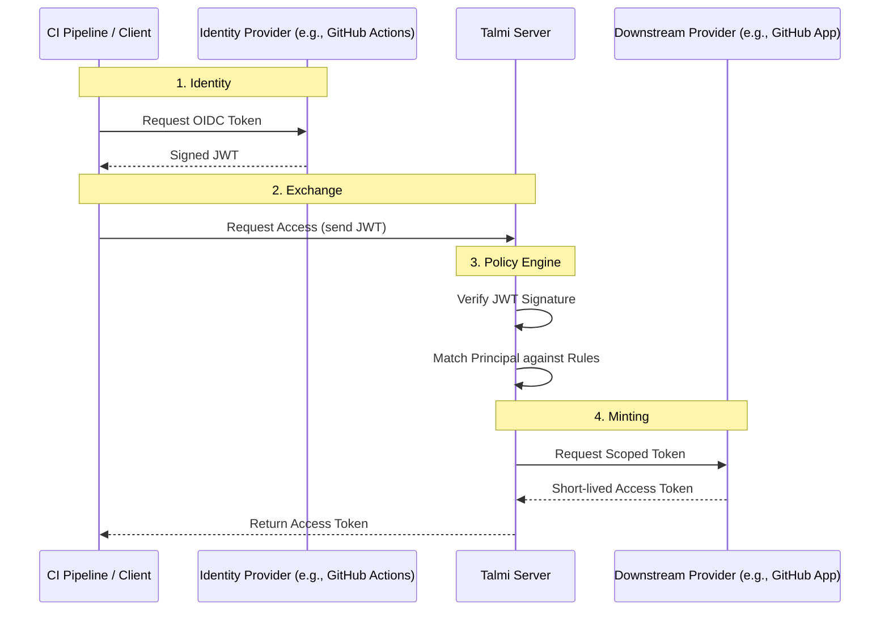

# Talmi

Talmi is a minimal, extensible Security Token Service (STS) written in Go.
It allows you to grant access to downstream resources (e.g. short-lived GitHub tokens via GitHub Apps)
based on _trusted_ identities from upstream Identity Providers (OIDC).

## Overview

Workloads often require credentials to perform actions (e.g., a CI pipeline needing to push to a git repository).
Storing long-lived credentials (static keys) in CI environments poses a security risk.

Here, the idea of OIDC federation comes into play. Platforms like GitHub Actions can issue short-lived OIDC tokens that
prove the identity of the workload. Talmi, a Security Token Service (STS), can then verify this identity,
check it against defined policies, and mint short-lived, scoped credentials for the requested resource.

This allows you, to for example, let your CI pipelines access only specific repositories during a deployment job,
without ever needing to store long-lived secrets in your CI environment. If some specific pipeline needs leveraged
access, you can simple define a new rule matching that pipeline's identity and return a new artifact (i.e. token)
with the required permissions.

One of the big advantages (besides security) is auditability. Since all tokens are short-lived and minted on-demand,
you have a clear audit trail of who accessed what, when, and why. Talmi keeps detailed audit logs of all access requests and decisions.
Additional, Talmi keeps track of all minted artifacts, allowing you to see which and how many tokens are currently valid.

### Architecture



## Installation

### From Source

```bash
go install github.com/darmiel/talmi@latest
```

## Configuration

Talmi is configured via a YAML file.

**`talmi.yaml`**

```yaml
audit:
  enabled: true
  type: jsonl
  path: "/var/log/talmi/audit.jsonl"

issuers:
  - name: github-actions
    type: oidc
    issuer_url: "https://token.actions.githubusercontent.com"

providers:
  - name: github-prod
    type: github-app
    app_id: 123456
    private_key_path: "private-key.pem"

rules:
  - name: ci-deploy-access
    description: "Allow main branch CI to access production repo"
    match:
      issuer: "github-actions"
      conditions:
        - key: "repository"
          operator: "equals"
          value: "my-org/backend-service"
        - key: "job_workflow_ref"
          operator: "contains"
          value: "refs/heads/main"
    grant:
      provider: "github-prod"
      permissions:
        contents: "read"
        deployments: "write"
      config:
        owner: "my-org"
        repositories: [ "production-infrastructure" ]
```

## Running the Server

Start the Talmi server using the `serve` command.

```bash
talmi serve --config talmi.yaml --addr :8080
```

### Administration

To perform administrative tasks, you must first authenticate with Talmi using a token that matches a rule granting
access to the `talmi` provider. You can find an example how to do so in `talmi-example.yaml`.

**Login:**

```bash
# Exchanges your current OIDC token for a Talmi Session Token
talmi login --server https://talmi.internal --token $TALMI_TOKEN
```

**Audit Logs:**
View recent access logs, including denied requests.

```bash
talmi audit log --limit 50
```

**Active Tokens:**
View currently valid tokens minted by the server.

```bash
talmi audit tokens
```

... TODO: more to come ...
