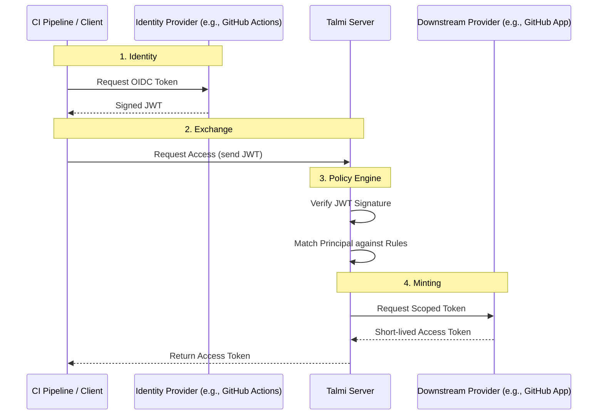

# Talmi

Talmi is a minimal, extensible Security Token Service (STS) written in Go.
It allows you to grant access to downstream resources (e.g. short-lived GitHub tokens via GitHub Apps)
based on _trusted_ identities from upstream Identity Providers (OIDC).

## Overview

Workloads often require credentials to perform actions (e.g., a CI pipeline needing to push to a git repository).
Storing long-lived credentials (static keys) in CI environments poses a security risk.

Here, the idea of OIDC federation comes into play. Platforms like GitHub Actions can issue short-lived OIDC tokens that
prove the identity of the workload. Talmi, a Security Token Service (STS), can then verify this identity,
check it against defined policies, and mint short-lived, scoped credentials for the requested resource.

This allows you, to for example, let your CI pipelines access only specific repositories during a deployment job,
without ever needing to store long-lived secrets in your CI environment. If some specific pipeline needs leveraged
access, you can simple define a new rule matching that pipeline's identity and return a new artifact (i.e. token)
with the required permissions.

One of the big advantages (besides security) is auditability. Since all tokens are short-lived and minted on-demand,
you have a clear audit trail of who accessed what, when, and why. Talmi keeps detailed audit logs of all access requests
and decisions.
Additional, Talmi keeps track of all minted artifacts, allowing you to see which and how many tokens are currently
valid.

### Architecture



---

### Usage

Talmi operates as a centralized gateway. Instead of distributing long-lived credentials to your CI/CD pipelines, you
configure Talmi to exchange short-lived OIDC identities for specific, scoped access tokens.

#### Policy-based Access Control

Talmi enforces strict separation between **Identity** and **Permissions**. A caller (e.g., a GitHub Action) cannot
request specific permissions directly. Instead, Talmi evaluates the caller's identity against a set of **predefined
rules** to determine what access to grant.

Rules are evaluated in the order they appear in the configuration. **The first match wins**: the
first rule that satisfies the criteria is used to mint the token, and subsequent rules are ignored.
This allows you to define specific high-priority overrides before general fallback rules.

**Example Rule:**

```yaml
  - name: allow-company-employees
    description: "Allow @company.com users to get a read-only Talmi JWT"
    match:
      issuer: cam-oidc-production
      condition:
        sub: { contains: "@company.com" }
    grant:
      provider: talmi
      config:
        roles: [ "audit" ]
```

The following conditions are supported:

* **Logic:** `all` (AND), `any` (OR), `not`.
* **Operators:** `equals`, `contains`, `in`, `exists`.
* **Expressions:** Use `expr` syntax for complex logic (e.g., arithmetic or string manipulation).

A more complex example:

```yaml
  - name: ...
    description: ...
    match:
      issuer: flower-oidc
      conditions:
        all:
          - user: { contains: "@company.com" }
          - not: { user: "bob@company.com" } # what did you do, Bob?
    grant:
      ...
```

#### Debugging Policies

To understand why a request was granted or denied, use the `why` command. This simulates a request and produces a
detailed execution trace, showing exactly which conditions passed or failed for every rule.

```bash
talmi why -f examples/talmi-testing.yaml --token $JWT
```


> [!NOTE]
> This command can be run against a remote server (`--server`) which requires `admin` privileges,
> or locally using a config file (`-f talmi.yaml`) for offline testing.

#### Auditing and Observability

Talmi provides built-in tools to track access and security events.

**Active Tokens**

The token registry tracks all currently valid tokens issued by the system. This provides real-time visibility into who
has access to your infrastructure right now.

```bash
talmi audit tokens
```


**Audit Log**

The audit log records every access request, including denied requests:

```bash
talmi audit log --limit 50
```


#### Flexible Providers

Providers are the downstream services that mint the actual access tokens. Talmi currently supports:

* **GitHub Apps:** Mint installation access tokens.
* **Talmi JWT:** Mint tokens for Talmi administrative access.
* **Stub:** Returns dummy tokens for testing configuration flow.

You can configure multiple providers of the same type to enforce the **Principle of Least Privilege**.

For example, you might configure two GitHub providers:

1. `github-ci-reader`: A GitHub App with only "Read-Only" permissions, available to all CI pipelines.
2. `github-admin`: A GitHub App with "Write" permissions, restricted to a specific list of repository owners via Policy
   Rules.

This means you don't need to create a single, over-privileged GitHub App. Instead, you can create multiple Apps with
specific permission sets and control access via Talmi's policy engine.

#### Flexible Issuers

Issuers represent the trusted Identity Providers (IdPs) that sign the incoming tokens. While Talmi supports static token
maps for testing, production environments typically use OIDC.

To configure an OIDC issuer, provide the `issuer_url` and the expected `client_id` (Audience).

> [!IMPORTANT]
> The Talmi server requires network access to the Issuer's URL
> (specifically the `.well-known/openid-configuration` endpoint) to fetch public keys for signature verification.

#### Tips

* **Inspect Tokens:** If you are unsure what claims your OIDC token contains, you can inspect them without verifying the
  signature using:
  ```bash
  talmi attributes --token $JWT
  ```
* **Environment Variables:** Some CLI flags (like `--server` or `--log-level`) can be set via environment variables

---

## Quick Start

### Installation

```bash
go install github.com/darmiel/talmi@latest
```

## Running the Server

Start the Talmi server using the `serve` command.

```bash
talmi serve --config talmi.yaml --addr :8080
```

### Administration

To perform administrative tasks, you must first authenticate with Talmi using a token that matches a rule granting
access to the `talmi` provider. You can find an example how to do so in
[`examples/talmi-testing.yaml`](examples/talmi-testing.yaml).
