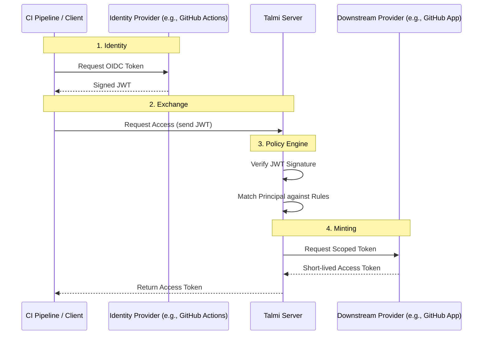

# Talmi

Talmi is a small Security Token Service (STS) written in Go.

It verifies upstream identity tokens (usually OIDC JWTs), evaluates them against policy rules, and mints short-lived
downstream artifacts (for example GitHub App tokens). Talmi can record audit logs and keep a registry of currently
active (non-expired) tokens.

## Why Talmi exists

Workloads (CI jobs, automation, services) often need credentials to call APIs. Long-lived secrets in build systems are
hard to protect and hard to audit.

With OIDC federation, the workload gets a short-lived identity token from an upstream issuer (e.g. GitHub Actions) that
proves its identity. Talmi can then verify this identity, check it against defined policies, and mint short-lived,
scoped credentials for the requested resource.

## How Talmi works

The basic flow to issue an artifact (=> token) is as follows:

* Receive an upstream token (OIDC JWT).
* Verify the token and build a principal (subject + claims).
* Evaluate rules in order. **First match wins.**
* Mint an artifact (=> token) using the rule’s provider configuration.
* Audit

---

### Quick Start

You can install the Talmi CLI and server using `go install`:

```bash
go install github.com/darmiel/talmi@latest
```

Create a configuration file `talmi.yaml` - you can find an example in the
[`examples/`](examples/) directory.

Then start the Talmi server:

```bash
talmi serve --config talmi.yaml --addr :8080
```

To perform administrative tasks, you must first authenticate with Talmi using a token that matches a rule granting
access to the `talmi` provider. You can find an example how to do so in
[`examples/talmi-testing.yaml`](examples/talmi-testing.yaml) (see `talmi-jwt` provider).

---

## Concepts

### Issuer

An issuer is a trusted source of upstream identity tokens. In most setups this is OIDC (Talmi fetches signing keys via
the issuer’s discovery endpoints).

The issuer configuration determines:

* which token sources are trusted
* which audience/client ID is expected
* how verification happens

```yaml
issuers:
  - name: name-of-issuer
    type: oidc
    issuer_url: https://issuer.example.com/
    client_id: my-audience
```

> [!IMPORTANT]
> The Talmi server requires network access to the Issuer's URL
> (specifically the `.well-known/openid-configuration` endpoint) to fetch public keys for signature verification.

### Principal

After verification Talmi represents the caller as a principal:

* `principal.id` (usually the token subject)
* `principal.issuer` (which issuer verified the token)
* `principal.attributes` (claims from the token, e.g. sub, repository, workflow, etc.)

Rules match against these attributes.

### Rule

Rules are policy entries that map identity to a grant.

**Important properties:**

* Rules are evaluated top to bottom
* First matching rule wins
* A rule has:
    * `match`: issuer + conditions
    * `grant`: which provider to mint from (and its config)

**A minimal rule shape:**

```yaml
- name: allow-something
  match:
    issuer: my-oidc
    condition: ...
  grant:
    provider: github
    config: ...
```

### Provider

Providers mint the downstream artifact. Talmi’s policy engine decides which provider and how it should mint, but the
provider decides the concrete “artifact” format (e.g., GitHub installation token, Talmi admin JWT, etc.).

**Currently supported providers:** (check [provider/registry.go](internal/providers/registry.go) for the full list)

* `stub`: returns dummy tokens for testing and writes to log
* `github-app`: mints GitHub App installation tokens. For configuration details
  see [`GitHubAppProviderConfig`](internal/providers/github_app.go)
  and [`GitHubAppGrantConfig`](internal/providers/github_app.go)
* `talmi-jwt`: mints Talmi admin JWTs for accessing Talmi server admin APIs.
  For configuration details see [`TalmiJWTProviderConfig`](internal/providers/talmi_jwt.go)
  and [`TalmiJWTGrantConfig`](internal/providers/talmi_jwt.go)

You can configure multiple providers of the same kind to enforce the **Principle of Least Privilege**.

For example, you might configure two GitHub providers:

1. `github-ci-reader`: A GitHub App with only "Read-Only" permissions, available to all CI pipelines.
2. `github-admin`: A GitHub App with "Write" permissions, restricted to a specific list of repository owners via Policy
   Rules.

This means you don't need to create a single, over-privileged GitHub App. Instead, you can create multiple Apps with
specific permission sets and control access via Talmi's policy engine.

---

## Writing match conditions

Talmi supports simple matchers for common cases, plus composition for more complex logic.

### Simple Matchers

```yaml
match:
  issuer: flower-oidc
condition:
  sub: { contains: "@company.com" }
```

Supported operators (from the existing README/code intent):

* `equals`
* `contains`
* `in`
* `exists`
* for a full list see [condition.go](internal/core/condition.go)

### Combine conditions

Use `all` (AND), `any` (OR), and `not`:

```yaml
match:
  issuer: flower-oidc
  conditions:
    all: # all following conditions must match
      - user: { contains: "@company.com" }
      - not: { user: "bob@company.com" } # what did you do, Bob?
```

> [!TIP]
> If you cannot use the short syntax, for example when your attribute name collides with one of the operators, you can use
> the long syntax:
>
> ```yaml
> condition:
>   key: all
>   operator: equals
>   value: some-value
> ```

**Keep rules ordered from most specific to most general.**

## Debugging Policies

Before writing rules, confirm what claims your upstream tokens actually contain. Talmi
includes a helper (`talmi attributes`) that decodes JWT claims without validating them.
Use it to learn the available attribute names and values, then write match conditions against those.

### Use `why` when rules don’t behave as expected

`why` produces a structured trace of each rule and condition result. It’s the fastest way to see:

* which rule first matched
* exactly which condition failed and why
* whether issuer matching/selection is the issue

`why` can run either:

* **locally** against a config file (useful while editing policies) by providing `-f talmi.yaml`
* **remotely** against a server where you are authenticated as `admin` (note that this does not produce an audit log
  entry)

> [!TIP]
> You view the evaluation trace for a previous request by providing the correlation ID you can find in the audit log:
> ```bash
> talmi why --replay-id <correlation-id>
> ```
> Note that this applies the _current_ policy configuration, not the one that was active at the time of the request.


---

## Auditing

Talmi provides built-in tools to track access and security events.

### Active Tokens

The token registry tracks all currently valid tokens issued by the system. You can list them using:

```bash
talmi audit tokens
```


### Audit Log

The audit log records every access request, including denied requests:

```bash
talmi audit log --limit 50
```

<details>
    <summary>It contains time, correlation-id, principal and status</summary>

```
╭───────────────────────────┬──────────────────────┬────────────────────────────┬───────────────╮
│ Time                      │ Correlation ID       │ Principal                  │ Action        │
├───────────────────────────┼──────────────────────┼────────────────────────────┼───────────────┤
│ 2025-12-17T22:55:47+01:00 │ d51idota26vcnr2h29ag │ daniel@company.com         │ ✔ issue_token │
│ 2025-12-17T23:01:46+01:00 │ d51igila26vcnr2h29b0 │ my-pipeline/my-job/my-task │ ✔ issue_token │
╰───────────────────────────┴──────────────────────┴────────────────────────────┴───────────────╯
```

</details>

To view full details of a specific audit entry (=> request), including metadata and errors, use:

```bash
talmi audit inspect <audit-id>
```

<details>
    <summary>This shows more information about this audit entry</summary>

```

── Audit Entry ──
  Correlation ID:            d51igila26vcnr2h29b0
  Time:                      Wed, 17 Dec 2025 23:01:46 CET
  Action:                    issue_token
  Decision:                  granted

── Identity ──
  Subject:                   my-pipeline/my-job/my-task
  Issuer:                    flower-oidc
  Action:                    issue_token
  Attributes:                
       aud:             [talmi-dev]
       exp:             1.766012497e+09
       iat:             1.766008897e+09
       intent:          create
       iss:             https://flower.d2a.io/oidc
       sub:             my-pipeline/my-job/my-task

── Request & Policy ──
  Action:                    issue_token
  Req. Provider:             (first grant)
  Req. Issuer:               (auto discover)
  Matched Rule:              allow-job-to-create-repositories

── Output ──
  Provider:                  github
  Fingerprint:               SQHSEnPLrtM2agiC5M4kLD+M5Wxzb4DXXd0OobIioaQ=
  Metadata:                  
       installation:    25508
       permissions:     map[actions:write]
       repositories:    <nil>
```

</details>


### Token Fingerprinting

All minting requests should contain the correlation ID by passing it as the `User-Agent` for requests in the following
format:

```
Talmi/v1.0.0 (correlation_id=%s; principal=%s; provider=%s)
```

Additionally, Talmi may compute a _fingerprint_ for each minted token (depending on the provider).
This allows you to track token usage in audit logs of downstream services (e.g., GitHub).

You can find more information about identifying audit log events in
GitHub [here](https://docs.github.com/en/enterprise-cloud@latest/admin/monitoring-activity-in-your-enterprise/reviewing-audit-logs-for-your-enterprise/identifying-audit-log-events-performed-by-an-access-token)

One common use-case: you see activity in a downstream system (e.g., GitHub Enterprise audit log) and want to find the
exact decision that produced the token.

#### Example: trace a GitHub token back to the Talmi decision

1. Copy the token fingerprint/hash from the downstream audit log
2. Search Talmi audit log entries for that fingerprint
3. Use Talmi’s `audit log --fingerprint=<fingerprint>` to locate the matching request(s).
4. Take the `Correlation ID` from the matching audit entry
   The correlation ID is the stable handle you use inside Talmi to inspect a single request in detail.
5. Inspect the full audit entry
   This shows the principal attributes, requested provider/issuer, matched rule (if any), provider output, and
   metadata/errors.
6. Run an evaluation trace (`why --replay-id=<correlation-id>`) to see the rule-by-rule evaluation trace. The trace is
   useful when:
    * a rule matched unexpectedly
    * a rule did not match when you thought it would
    * the wrong provider was chosen due to rule order
    * a condition failed due to missing/renamed claims

---

### Architecture



---

... README is under construction ...
