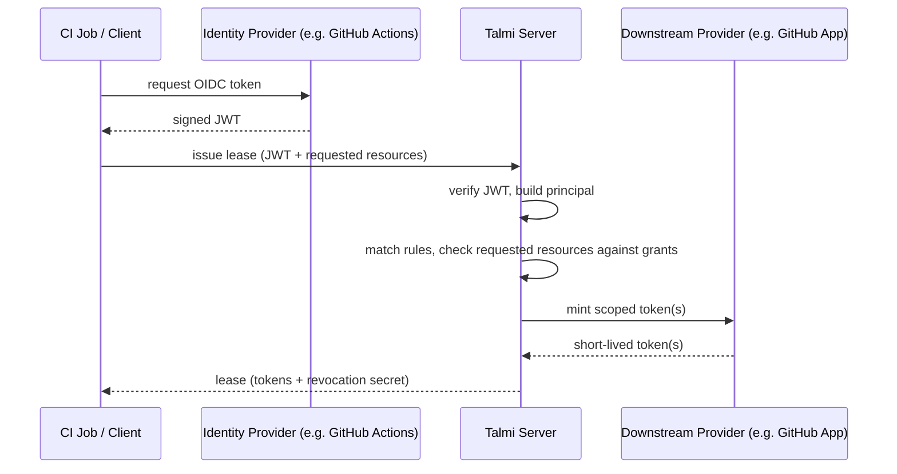

# Talmi

Talmi is a small Security Token Service (STS) written in Go.

It takes an upstream identity token (an OIDC JWT, or a GitHub OAuth token), checks it against
policy, and hands back short-lived, scoped downstream tokens (for example a GitHub App
installation token). Every request is audited, and issued tokens are tracked as *leases* that
can be revoked before they expire.

## Why Talmi exists

CI jobs, automation, and services constantly need credentials to call other APIs. Long-lived
secrets stored in a build system are hard to rotate, hard to scope, and hard to audit.

With OIDC federation the workload already gets a short-lived identity token from an upstream
issuer (GitHub Actions, say) that proves who it is. Talmi verifies that identity, checks it
against your rules, and mints a narrowly-scoped downstream credential for exactly the resource
the caller asked for. No standing secrets in the pipeline.

You can also run several providers of the same kind to keep privileges tight. Instead of one
over-powered GitHub App, register a read-only App for general CI and a write-capable App gated
by a rule that only matches a few repository owners.

## How it works


```mermaid
sequenceDiagram
    participant Client as CI Job / Client
    participant IdP as Identity Provider (e.g. GitHub Actions)
    participant Talmi as Talmi Server
    participant Provider as Downstream Provider (e.g. GitHub App)

    Client->>IdP: request OIDC token
    IdP-->>Client: signed JWT

    Client->>Talmi: issue lease (JWT + requested resources)
    Talmi->>Talmi: verify JWT, build principal
    Talmi->>Talmi: match rules, check requested resources against grants
    Talmi->>Provider: mint scoped token(s)
    Provider-->>Talmi: short-lived token(s)
    Talmi-->>Client: lease (tokens + revocation secret)
```

The steps for a single `issue` request:

1. Verify the upstream token and build a principal (subject + claims).
2. Find the rules whose `match` accepts that principal.
3. For each requested resource, check that a matched rule's `allow` grants it.
4. Mint one downstream token per resource through the realm's provider.
5. Record the decision in the audit log and return the lease.

## Quick start

Install the CLI and server:

```bash
go install github.com/darmiel/talmi@latest
```

A working example tree lives in [`example/`](example/). The bootstrap file references three
sectioned directories:

```yaml
# talmi.yaml
store: { type: memory }
audit: { enabled: false }

signing:
  algorithm: HS256
  key: raw:change-me

issuers: { include: [ "issuers.d/*.yaml" ] }
realms: { include: [ "realms.d/*.yaml" ] }
rules: { include: [ "rules.d/*.yaml" ] }
```

Define one issuer, one realm, and one rule:

```yaml
# issuers.d/ci.yaml
- name: dev-ci
  type: static
  token_map:
    dev-token-123:
      sub: dev-pipeline
      team: platform
```

```yaml
# realms.d/gh.yaml
- realm: ghes-corp
  type: github-app
  capability:
    resources: [ "ghes-corp:acme/*" ]
    max_actions: [ "contents:read", "contents:write" ]
  instances:
    - name: gh-dev
      app_id: 12345
      private_key: file:/run/secrets/gh-app.pem
```

```yaml
# rules.d/dev.yaml
- name: dev-allow
  match:
    issuer: dev-ci
    allow_empty: true
  allow:
    - resources: [ "ghes-corp:acme/*" ]
      actions: [ "contents:read" ]
```

Check it, then start the server:

```bash
talmi config vet talmi.yaml
talmi serve --config talmi.yaml --addr :8080
```

Request a token. For a real run the token comes from your OIDC provider; with the `static`
issuer above the "token" is just the map key:

```bash
talmi issue --resource "ghes-corp:acme/svc-a=contents:read" --token dev-token-123
```

While iterating on config you can run the server with `--dev`, which swaps every real provider
for an in-memory stub that returns dummy tokens. That lets you exercise policy and leases
without any GitHub or Artifactory credentials.

## Concepts

### Issuer

An issuer is a trusted source of upstream identity. Rules match against the claims an issuer
produces. Four types exist:

- `oidc`: verifies an OIDC ID token against the issuer's discovery keys. Needs `issuer_url` and
  `client_id`. The principal id is the token `sub`; attributes are all claims.
- `static`: maps fixed token strings to attributes. Useful for local development and tests.
- `github-oauth`: verifies a GitHub / GHES OAuth access token by calling the GitHub API. The
  principal id is the login; attributes include `login`, `orgs`, and `teams` (as `org/slug`).
  This is what backs human admin login.
- `talmi-session`: verifies a session JWT that Talmi itself signed. Used for admin API calls
  after `talmi login`.

```yaml
- name: corp-oidc
  type: oidc
  issuer_url: https://issuer.example.com/
  client_id: talmi
```

> [!IMPORTANT]
> For `oidc`, the server needs network access to the issuer's
> `.well-known/openid-configuration` endpoint to fetch signing keys.

### Principal

After verification the caller is represented as a principal: an `id`, the `issuer` that
verified it, and a bag of `attributes` (the claims). Conditions and expressions in rules
evaluate against these. Both `issuer`/`iss` and `id`/`sub` are exposed for convenience.

### Realm and provider

A *realm* is a namespace of resources with its own meaning of "resource" and "action". A
*provider* is the backend that actually mints tokens for a realm. The realm block's `type`
picks the backend:

- `github-app`: mints GitHub App installation tokens. Instance config: `app_id`,
  `private_key`, optional `server` (for GHES).
- `artifactory`: mints JFrog Artifactory access tokens. Instance config: `admin_token`,
  `groups`, optional `base_url`.
- `talmi`: the session realm. It has no provider backend and mints nothing. It exists so admin
  resources (`talmi:session`, `talmi:audit`, `talmi:tasks`) have semantics that rules can grant.

A realm can hold several `instances` (individual Apps/servers). `capability` sets what the
realm may hand out (`resources` globs, `max_actions` ceiling); an instance can override it.

```yaml
- realm: ghes-corp
  type: github-app
  capability:
    resources: [ "ghes-corp:acme/*" ]
    max_actions: [ "contents:read", "contents:write" ]
  instances:
    - name: gh-ci-reader
      app_id: 111
      private_key: file:/run/secrets/reader.pem
    - name: gh-ci-writer
      app_id: 222
      private_key: file:/run/secrets/writer.pem
```

The session realm is declared once with no instances:

```yaml
- realm: talmi
  type: talmi
  instances: [ ]
```

### Resources and actions

A resource pattern is `<realm>:<body>`, where the body is a glob. Actions are strings whose
meaning depends on the realm:

- `github-app`: actions are `<permission>:<level>`, e.g. `contents:write`, `actions:read`.
  Levels are ordered `none < read < write < admin`, so granting `contents:write` covers a
  request for `contents:read`.
- `artifactory`: actions are bare levels, ordered `read < annotate < write`.
- `talmi`: actions are exact strings with no ordering, e.g. `login`, `read`, `trigger`.

Examples: `ghes-corp:acme/*=contents:read`, `talmi:audit=read`.

### Rule

Rules map identity to grants. A rule has a `match` (which principals it applies to) and a list
of `allow` entries (what those principals may request). Every rule whose `match` accepts the
principal contributes its `allow` entries, and a requested resource is granted only if that
union covers it. If any requested resource is left uncovered, the whole request is denied.
Rule order does not change the outcome, so group rules however reads best.

```yaml
- name: talmi-admins
  match:
    issuer: gh-human
    condition:
      teams: { contains: "talmi-dev-poc/admin-users" }
  allow:
    - { resources: [ "talmi:session" ], actions: [ "login" ] }
    - { resources: [ "talmi:audit" ],   actions: [ "read" ] }
    - { resources: [ "talmi:tasks", "talmi:tasks/*" ], actions: [ "read", "trigger" ] }
```

### Conditions

`match.condition` filters on principal attributes. The short form covers the common cases:

```yaml
condition:
  sub: { contains: "@company.com" }   # operator form
  team: platform                       # equality shorthand
```

Listing several keys means all of them must hold (AND). For explicit logic use `all`, `any`,
and `not`:

```yaml
condition:
  all:
    - user: { contains: "@company.com" }
    - not: { user: "bob@company.com" }   # sorry, Bob
```

Operators: `equals`, `contains`, `in`, `exists`. If an attribute name collides with an
operator, use the long form:

```yaml
condition:
  key: in
  operator: equals
  value: some-value
```

For matching that conditions can't express, use `expr` instead of `condition` (one or the
other, not both). An empty condition denies by default; set `allow_empty: true` to make a rule
with no condition match every principal from its issuer.

### Lease and revocation

`issue` returns a *lease*: the minted tokens, their expiry, and a revocation secret. Save it
with `--out`, which writes `lease.json`:

```bash
talmi issue \
  --resource "ghes-corp:acme/svc-a=contents:write" \
  --token "$OIDC" \
  --out ./.talmi/out
```

Revoke before expiry, either from the saved lease or by hand:

```bash
talmi revoke --from-lease ./.talmi/out/lease.json
talmi revoke --secret "$SECRET" --token "<artifact-id>=<token-value>"
```

Revocation is idempotent and tracked per artifact, so a partially-completed revoke can be
retried safely.

### Signing and sessions

Talmi signs admin session JWTs with the key in `signing`. `ES256` is the default and expects an
EC private key in PEM (via a `secret.Ref`). `HS256` uses a raw shared secret, which is fine for
local runs.

```yaml
signing:
  algorithm: ES256
  key: file:/run/secrets/session-signing-key.pem
```

Under `--dev` with no key configured, Talmi generates an ephemeral ES256 key at startup
(sessions won't survive a restart).

## Configuration layout

The bootstrap file (`talmi.yaml`) holds server-wide settings and points at the issuers, realms,
and rules through glob includes. Each matched file is a YAML list of blocks, loaded in sorted
path order:

```yaml
issuers: { include: [ "issuers.d/*.yaml" ] }   # list of issuer blocks
realms: { include: [ "realms.d/*.yaml" ] }    # list of realm blocks
rules: { include: [ "rules.d/*.yaml" ] }     # list of rules
```

Other bootstrap sections:

- `store`: `memory` or `postgres` (with a `dsn`). Holds the lease registry.
- `audit`: `enabled`, plus `type` (`postgres`, `memory`, or `noop`) and a `dsn`.
- `auth`: enables the admin API. Names the `login_issuer` (a `github-oauth` issuer) and
  `session_issuer` (a `talmi-session` issuer), plus `session_ttl`, the OAuth `server`,
  `client_id`, and `scopes`.
- `source`: where the config tree comes from.

Secrets are never inline values. A `secret.Ref` is a scheme-prefixed string: `raw:literal`,
`file:/path`, or `env:VAR_NAME`.

### Loading config from GitHub

Instead of local files, Talmi can read the tree from a GitHub repository, pinned to a commit
for reproducibility. Configure a `source.github` block with a GitHub App that can read the repo:

```yaml
source:
  github:
    server: https://github.example.com/
    owner: my-org
    repo: talmi-config
    ref: main
    app_id: 1815
    installation_id: 25508
    private_key: file:/run/secrets/config-source.pem
  sync:
    interval: 8h   # periodically re-pull the tree
```

`serve` and `config vet` resolve the source the same way. Pass `--local` to force local files,
or `--ref <branch|tag|sha>` to vet a specific commit before it merges.

## Validating configuration

`config vet` checks the assembled tree and reports problems with source positions.

```bash
talmi config vet talmi.yaml            # offline structural checks
talmi config vet talmi.yaml --online   # also probe providers for capability/coverage
talmi config vet talmi.yaml --strict   # treat warnings as errors (good for CI)
talmi config vet talmi.yaml --format json
```

`--online` builds each provider and asks it what resources it can serve, then flags rules that
grant resources no working provider can actually mint.

For editor support, generate JSON Schemas and point your YAML language server at them:

```bash
talmi config schema config  -o docs/schema/config.schema.json
talmi config schema issuers -o docs/schema/issuers.schema.json
talmi config schema realms  -o docs/schema/realms.schema.json
talmi config schema rules   -o docs/schema/rules.schema.json
```

Add a modeline to the top of a config file so the editor validates as you type:

```yaml
# yaml-language-server: $schema=./docs/schema/config.schema.json
```

## Admin access

Audit and task commands require an authenticated session. `talmi login` runs a GitHub device
flow, verifies your identity through the `login_issuer`, and stores a session JWT signed by the
server. Your GitHub identity still has to satisfy a rule granting `talmi:session=login` (see the
`talmi-admins` rule above).

```bash
talmi login
talmi login --with-token "$GH_TOKEN"   # skip the device flow
```

## Auditing

Every request is recorded, including denials. List and filter the log (needs a session with
`talmi:audit=read`):

```bash
talmi audit --limit 50
talmi audit --action lease.issue --principal my-pipeline/my-job
talmi audit --since 2026-01-01T00:00:00Z --json
```

### Tracing a token back to a decision

Depending on the provider, Talmi records a *fingerprint* of each minted token. When a downstream
system (for example a GitHub audit log) shows activity by a token, use the fingerprint to find
the request that produced it:

```bash
talmi audit --fingerprint "<fingerprint>"
```

Take the correlation id from the matching entry and replay the decision to see the rule-by-rule
trace, without minting anything:

```bash
talmi why --replay-id "<correlation-id>"
```

`why` also runs ahead of time against a live token, which is the fastest way to understand why a
rule did or didn't match:

```bash
talmi why --token "$OIDC" --resource "ghes-corp:acme/svc-a=contents:write"
```

The trace shows which rules matched, and for each requested resource whether some grant covered
it (and if not, why).

## CLI reference

| Command                           | What it does                                                                                                        |
|-----------------------------------|---------------------------------------------------------------------------------------------------------------------|
| `talmi serve`                     | Run the server. Flags: `-c/--config`, `--addr`, `--dev`, `--local`, `--ref`.                                        |
| `talmi issue TOKEN`               | Exchange an OIDC token for resource tokens. `--resource` (repeatable), `--manifest`, `--out`, `--issuer`, `--json`. |
| `talmi revoke`                    | Revoke a lease. `--from-lease`, or `--secret` + `--token id=value`.                                                 |
| `talmi why TOKEN`                 | Explain a decision (dry run). `--resource`, `--manifest`, `--issuer`, `--replay-id`, `--json`.                      |
| `talmi login`                     | Authenticate via GitHub. `--with-token`.                                                                            |
| `talmi audit`                     | Query the audit log. `--limit`, `--action`, `--principal`, `--fingerprint`, `--since`, `--json`.                    |
| `talmi tasks list\|trigger\|logs` | Inspect and run background tasks (admin session).                                                                   |
| `talmi config vet [file]`         | Validate config. `--online`, `--strict`, `--format`, `--local`, `--ref`.                                            |
| `talmi config schema [target]`    | Emit JSON Schema for `config`, `issuers`, `realms`, or `rules`. `-o`.                                               |
| `talmi debug attributes JWT`      | Print a JWT's claims without verifying it.                                                                          |
| `talmi debug fingerprint TOKEN`   | Compute a token fingerprint. `--type`, `-r/--raw`.                                                                  |
| `talmi info`                      | Show version/build info (local or from `--server`).                                                                 |

Global flags apply to every command: `--server` (or `$TALMI_ADDR`), `--log-level`,
`--log-format`, `--no-color`, `--cli-config`.

A `--manifest` file lists resources instead of repeating `--resource`:

```yaml
# .talmi/access.yaml
resources:
  - resource: "ghes-corp:acme/svc-a"
    actions: [ "contents:write" ]
  - resource: "ghes-corp:acme/svc-b"
    actions: [ "contents:read" ]
```

```bash
talmi issue --manifest .talmi/access.yaml --token "$OIDC"
```
