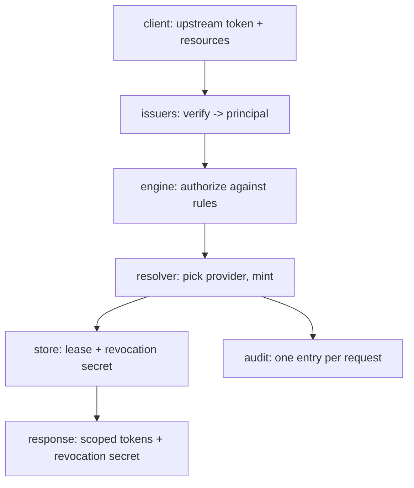

# Architecture

Talmi runs every token request through the same four-stage pipeline. The other Concepts pages cover
each piece in detail.

## The request pipeline

`POST /v2/token/issue` runs four stages:

1. **Verify** ([issuers](issuers-and-principals.md)) - the upstream token is checked against its
   issuer and becomes a *principal* (`id`, `issuer`, `attributes`).
2. **Authorize** ([rules](resources-actions-rules.md)) - the engine unions the `allow` statements of
   every rule matching the principal and checks each request against the realm's semantics. It fails
   closed: anything not covered (or explicitly denied) denies the whole request.
3. **Resolve and mint** ([realms and providers](realms-and-providers.md)) - the resolver selects the
   least-privileged provider that can serve each resource and mints one token per batch, rolling back
   on partial failure.
4. **Persist and audit** ([leases](leases.md)) - artifacts become a lease with a revocation secret,
   and an audit entry is written per request.

## Package map

For contributors, the important packages:

| Package              | Responsibility                                                                                  |
|----------------------|-------------------------------------------------------------------------------------------------|
| `internal/core`      | Domain types shared by everyone: `Principal`, `Rule`, `Resource`/`Action`, `Decision`, `Lease`. |
| `internal/issuers`   | Verify upstream tokens into a `Principal`.                                                      |
| `internal/engine`    | The policy engine: `Authorize`, rule matching, condition evaluation.                            |
| `internal/realm`     | Per-realm semantics: coverage, level comparison, pattern validation.                            |
| `internal/resolver`  | Select the least-privileged provider per resource, plan, mint, roll back.                       |
| `internal/providers` | Provider backends: `github`, `jfrog`, and a `stub` for dev/test.                                |
| `internal/service`   | `TokenService`: orchestrates the pipeline.                                                      |
| `internal/store`     | Lease persistence: in-memory and postgres.                                                      |
| `internal/audit`     | Audit log and token fingerprinting.                                                             |
| `internal/config`    | Bootstrap + sectioned config types, includes, schema.                                           |
| `internal/configvet` | Offline and online config validation.                                                           |
| `internal/runtime`   | Builds a `Runtime` from config and hot-reloads it atomically.                                   |
| `internal/api`       | HTTP server, routes, handlers, middleware.                                                      |

The [CONTRIBUTING guide](https://github.com/darmiel/talmi/blob/main/CONTRIBUTING.md) covers the
internals and the security-critical code paths.

## See also

- Get started: [Quickstart](../getting-started/quick-start.md)
- New to the ideas: [Background](../introduction/background.md)
