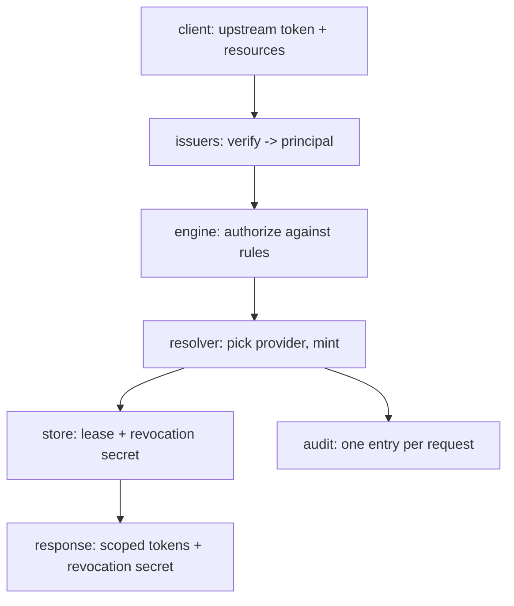

# How Talmi works

Talmi runs every token request through the same four-stage pipeline. The other Concepts pages cover each piece in
detail.

## The request pipeline

`POST /v2/token/issue` runs four stages:

1. **Verify** ([issuers](issuers-and-principals.md)) - the upstream token is checked against its issuer and becomes a
   *principal* (`id`, `issuer`, `attributes`).
2. **Authorize** ([rules](resources-actions-rules.md)) - the engine unions the `allow` statements of every rule matching
   the principal and checks each request against the realm's semantics. It fails closed: anything not covered (or
   explicitly denied) denies the whole request.
3. **Resolve and mint** ([realms and providers](realms-and-providers.md)) - the resolver selects the least-privileged
   provider that can serve each resource and mints one token per batch, rolling back on partial failure.
4. **Persist and audit** ([leases](leases.md)) - artifacts become a lease with a revocation secret, and an audit entry
   is written per request.

## Least privilege, enforced at every layer

No single stage decides the whole grant. The token a caller gets is the intersection of three independent ceilings, and
none of them can widen what another allows:

- The **realm capability** is the hard ceiling: the most any token from that realm could ever cover, either declared
  statically or discovered live from the backend.
- A **rule** grants a subset of that capability to the principals it matches.
- The **request** narrows it again to the exact resources and actions asked for.

A request is authorized only if the union of matching rules covers every requested `resource=action`, and the result is
then clamped to the capability. If any requested item is not covered, the whole request is denied. This is why adding a
rule can never grant more than the backend actually permits.

## Failure handling

The pipeline fails closed. Verification, authorization, and resolution each deny (or error) rather than guess. Minting
is transactional across providers: if a request spans several providers and one mint fails, Talmi rolls back the tokens
it already minted so a caller never receives a partial grant. A lease is written only after every artifact is minted and
persisted.

## Configuration reloads

The issuers, realms, and rules come from a config tree that can change while the server runs. Talmi builds a new
snapshot off to the side and swaps it in only if it builds cleanly, so a bad change never takes down the running config.
Each successful swap is a new revision, recorded on audit events. See
[Configuration model and trust](configuration-model.md).

## For contributors

The [CONTRIBUTING guide](https://github.com/darmiel/talmi/blob/main/CONTRIBUTING.md) covers the internal package layout
and the security-critical code paths.

## See also

- Get started: [Quickstart](../getting-started/quick-start.md)
- New to the ideas: [Background](../introduction/background.md)
