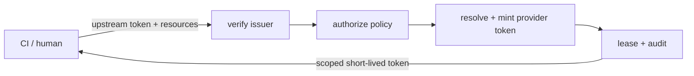

# Talmi


Talmi is a short-lived token service (STS). A caller that already has a verified identity, a CI
pipeline with an OIDC token or a human logged in with GitHub, asks Talmi for access to a specific
resource. Talmi checks a policy, mints a downstream token scoped to exactly that resource (a GitHub
App installation token, a JFrog Artifactory access token), and hands it back with an expiry and a
handle to revoke it early. Every exchange is written to an audit log.

The point is to get long-lived secrets out of build systems. A static PAT or service key in CI is
hard to scope, hard to rotate, and hard to trace back to a single job. Talmi replaces it with a
request-time exchange: the caller proves who it is, Talmi decides whether the policy allows the
request, and issues a token that expires on its own and only covers what was asked for.

[Get started](getting-started/quick-start.md){ .md-button .md-button--primary }
[Read the concepts](concepts/index.md){ .md-button }


## What a request looks like


A CI job that needs read access to one repository sends its OIDC token as the bearer and lists the
resource and actions it wants:


```bash
curl -sS -X POST http://localhost:8080/v2/token/issue \
  -H "Authorization: Bearer $CI_OIDC_TOKEN" \
  -H "Content-Type: application/json" \
  -d '{
        "resources": [
          { "resource": "ghes-corp:acme/svc-a", "actions": ["contents:read"] }
        ]
      }'
```


If the policy allows it, Talmi mints a token scoped to just that repository and returns it with a
lease ID, a revocation secret, and an expiry:


```json
{
  "lease_id": "lse_3f9c1a...",
  "revocation_secret": "rvk_8a1d47...",
  "artifacts": [
    {
      "artifact_id": "art_01",
      "provider": "gh-dev",
      "realm": "ghes-corp",
      "token": "ghs_16C7e42F...",
      "expires_at": "2026-08-18T15:12:00Z"
    }
  ]
}
```


The job uses `token` for the next few minutes and forgets it. The same request runs from the CLI
without writing any JSON. Each resource is a `realm:resource=actions` string, and `--out` writes the
full lease (token values and revocation secret) to a file instead of printing it:


```bash
talmi lease issue \
  --resource "ghes-corp:acme/svc-a=contents:read" \
  --token "$CI_OIDC_TOKEN" \
  --out ./lease.json
```


When the job is done, a cleanup step revokes the lease so the token stops working right away instead
of lingering until it expires (and the same command handles the case where something went wrong).
From the saved lease file that is one line:


```bash
talmi lease revoke --from-lease ./lease.json
```


## One request, many providers


A single request can list resources from different realms. Talmi routes each resource to the
least-privileged provider that can serve it, mints one token per provider, and rolls the whole thing
back if any part fails. So a job that pushes an image and reads a repo asks once:


```bash
talmi lease issue \
  --resource "ghes-corp:acme/svc-a=contents:read" \
  --resource "artifactory:docker-local/team-a=write" \
  --token "$CI_OIDC_TOKEN"
```


The lease comes back with one artifact per provider, each scoped to only what that resource needed:


```json
{
  "lease_id": "lse_9b2e05...",
  "revocation_secret": "rvk_c40f18...",
  "artifacts": [
    {
      "artifact_id": "art_01",
      "realm": "ghes-corp",
      "provider": "gh-dev",
      "token": "ghs_16C7e42F...",
      "expires_at": "2026-08-18T15:12:00Z"
    },
    {
      "artifact_id": "art_02",
      "realm": "artifactory",
      "provider": "art-main",
      "token": "cmVmdGtu...",
      "expires_at": "2026-08-18T15:12:00Z"
    }
  ]
}
```


"Least-privileged" is enforced at every layer. A realm's `capability` is the ceiling of what it can
ever hand out, a rule grants a subset of that to a set of principals, and the request narrows it
again to the exact resources and actions asked for. Nothing in the chain can widen the grant, and a
request that is not fully covered is denied as a whole.


## The exchange





1. **Verify** - the upstream token is checked against its issuer and becomes a principal.
2. **Authorize** - the policy engine checks each requested `resource=actions`, failing closed.
3. **Resolve and mint** - the least-privileged capable provider mints one token per batch.
4. **Persist and audit** - the artifacts become a lease with a revocation secret and an audit entry.


## Explore


<!-- @formatter:off -->
<div class="grid cards" markdown>

-   __Getting started__

    ---

    Install Talmi, run a server, and issue your first token.

    [Installation](getting-started/installation.md) ·
    [Quick start](getting-started/quick-start.md)

-   __Concepts__

    ---

    How issuers, realms, rules, capabilities, and leases fit together.

    [Architecture](concepts/index.md)

-   __Configuration__

    ---

    Issuers, realms and providers, rules, secrets, and config sources.

    [Layout and trust model](configuration/layout.md)

-   __Operations__

    ---

    Run and deploy the server, sessions and admin, auditing.

    [Running the server](operations/server.md)

-   __Security__

    ---

    The trust model and a checklist for exposing Talmi publicly.

    [Security overview](security/index.md)

-   __CLI reference__

    ---

    Every command, flag, and the manifest format.

    [CLI reference](cli.md)

</div>
<!-- @formatter:on -->

