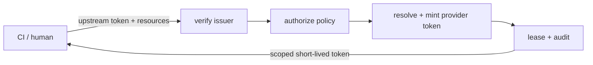

# Talmi

Talmi is a short-lived token service (STS). It exchanges a verified upstream identity (a CI
pipeline's OIDC token), a human's GitHub login - for narrowly scoped, short-lived downstream tokens (a
GitHub App installation token, a JFrog Artifactory access token), and records every exchange in an
audit log.

Long-lived secrets in a build system are hard to rotate, hard to scope, and hard to audit. Talmi
replaces them with a request-time exchange: the caller proves who it is, Talmi checks a policy, mints
a token scoped to exactly what was asked for, and returns it with an expiry and a revocation handle.

[Get started](getting-started/quick-start.md){ .md-button .md-button--primary }
[Read the concepts](concepts/index.md){ .md-button }

## The exchange

1. **Verify** - the upstream token is checked against its issuer and becomes a principal.
2. **Authorize** - the policy engine checks each requested `resource=actions`, failing closed.
3. **Resolve and mint** - the least-privileged capable provider mints one token per batch.
4. **Persist and audit** - the artifacts become a lease with a revocation secret and an audit entry.

## Explore

<!-- @formatter:off -->

-   __Getting started__

    ---

    Install Talmi, run a server, and issue your first token.

    [Installation](getting-started/installation.md) ·
    [Quick start](getting-started/quick-start.md)

-   __Concepts__

    ---

    How issuers, realms, rules, capabilities, and leases fit together.

    [Architecture](concepts/index.md)

-   __Configuration__

    ---

    Issuers, realms and providers, rules, secrets, and config sources.

    [Layout and trust model](configuration/layout.md)

-   __Operations__

    ---

    Run and deploy the server, sessions and admin, auditing.

    [Running the server](operations/server.md)

-   __Security__

    ---

    The trust model and a checklist for exposing Talmi publicly.

    [Security overview](security/index.md)

-   __CLI reference__

    ---

    Every command, flag, and the manifest format.

    [CLI reference](cli.md)

<!-- @formatter:on -->

